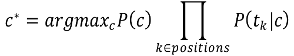
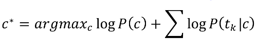
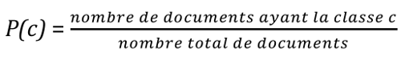
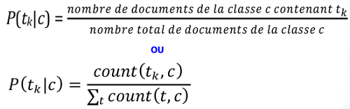
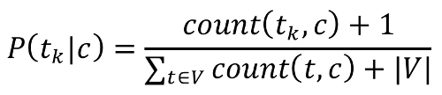

# Understanding communications

### Machine Learning Competition

## Context

Penguins have crashed into a metropolis. After a little work, they have
successfully connected to a network and have started to record communications.
However, because they are birds, they are not very good at making sense of all
of those tweets. Nevertheless, they have recognized a pattern and identified
four major categories:

- Media
- Businessman
- Politician
- Showbiz

They would like to design a system to automatically classify the information in
those four categories. So, they have started to manually label data...

## Competition description

At your disposal, you have the intercepted communications in csv format. The file
`train.csv` has two columns. The first column contains the communication and the
second column contains its label (an integer).

The correspondence between the textual label and its number is in the file `meta.csv`.

Your mission is to create a classifier to recognize the origin of the
communication. More precisely, you have to implement a classifier in the file
`classifier.py`. We provide a script `accuracy_tester.py` to easily verify the
performance of your algorithm on a csv dataset.

> **NOTE** The constructor of the Classifier class must load **pre-trained**
> parameters of you model. You are free to choose the structure of your code for training.

> **NOTE** Of course, we will test the performance of your classifier on data
> that is not at your disposal. This data will be in the exact same format as
> the provided dataset.

## Available software and libraries

- Numpy
- Jupyter
- Matplotlib
- Scipy
- PyTorch (if you are that kind of person...)

Machine learning libraries such as SciKitLearn or StanfordNLP are prohibited.
The goal of the competition is to implement an algorithm from scratch for text classification.

##  Questions et hints
For those of you who understood the hints in the competition description, you
should be just fine. For the rest of you, here are some hints on how to classify text.

### Bag-of-words
A simple approach is to imagine that the sequence of words in the communication is
not that important; only the distributions of words themselves is important. We
can use the frequency of appearance of the words in different classes to train a
Naïve Bayes classification model. Here are some formulas to implement such algorithm.

##### Objective function
The objective function finds the most probable class knowing
the words `t_i` that appear in the sequence. More formally:

For greater numeric stability, it is preferable to use the logarithm of those probabilities.

##### Class prior

##### Conditional probability of a word

##### Laplace smoothing

To avoid multiplying by probabilities with a value of 0, you can smooth the probability distributions.

### N-gram model
Instead of looking at words in isolation, you can split sequences into bi-grams.
For instance, the sequence

I am a penguin coming from space.

becomes

(I am) (am a) (a penguin) (penguin coming) (coming from) (from space.)

These bi-grams can then be used in the model described previously.

### Other ideas and questions

- Split the training set to have a validation set.
- Add manual rules using Regex.
- How do you treat unknown words during evaluation?
- Do you have to preprocess words?
- Do you have to consider every word in the model or can you filter out some words?

## Model upload

### Instructions
In your repo, briefly describe how your algorithm works in a README.md.

### Automatic grading
**Do not change the project structure**. An automatic script will evaluate your model.
